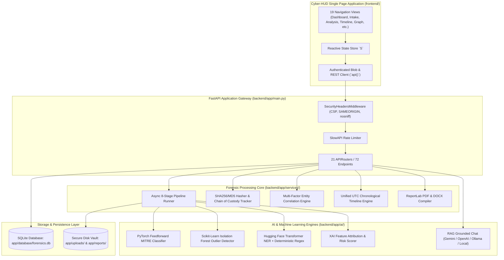

# T.A.C.T.I.C. — AI Digital Forensics Assistant

An enterprise-grade, AI-powered digital forensics investigation platform built for security analysts, incident responders, and forensic investigators. T.A.C.T.I.C. automates evidence ingestion, cryptographic hashing, entity extraction, anomaly detection, entity correlation, attack timeline reconstruction, human-in-the-loop finding review, and audit report generation.

---

## Architecture Overview



---

## Repository Structure

```text
AI Digital Forensics Assistant/
├── .env.example                 # Environment configuration template
├── .gitignore                   # Clean Git ignore rules (caches, DBs, staging)
├── app.py                       # Root development launcher (port-probe & uvicorn)
├── docker-compose.yml           # Multi-container deployment config
├── README.md                    # Platform documentation
├── requirements.txt             # Root requirements pointer (-r backend/requirements.txt)
│
├── backend/                     # Backend application root
│   ├── Dockerfile               # Production container definition (Python 3.11-slim)
│   ├── pytest.ini               # Pytest configuration & test markers
│   ├── requirements.txt         # Core dependencies (FastAPI, PyTorch, Transformers, etc.)
│   │
│   ├── app/                     # Application source package
│   │   ├── ai/                  # AI models (threat classifier, anomaly detector, NER, XAI)
│   │   ├── api/                 # 21 modular FastAPI routers (auth, evidence, analysis, etc.)
│   │   ├── auth/                # JWT security, password hashing, RBAC role checkers
│   │   ├── config.py            # Global application settings & rate limits
│   │   ├── database/            # SQLAlchemy session management & forensics.db
│   │   ├── main.py              # ASGI application bootstrap & middleware
│   │   ├── models/              # 15 SQLAlchemy ORM models with cascade integrity
│   │   ├── reports/             # Generated PDF and DOCX reports by case
│   │   ├── schemas/             # Pydantic request/response validation models
│   │   ├── services/            # Pipeline runner, integrity verifier, correlation engine
│   │   ├── startup.py           # DB migrations, admin seeding, security sanity checks
│   │   ├── uploads/             # Case-isolated evidence disk vault
│   │   └── utils/               # PDF/Word generators and formatting helpers
│   │
│   └── tests/                   # Automated test suite (114+ pytest test cases)
│       ├── conftest.py          # Shared fixtures, in-memory DB, offline test settings
│       ├── test_api_integration.py
│       ├── test_async_job_processing.py
│       ├── test_concurrent_uploads.py
│       ├── test_evidence_integrity.py
│       ├── test_forensic_timeline_engine.py
│       ├── test_live_server_api.py
│       └── ...
│
├── frontend/                    # Frontend client
│   ├── index.html               # High-performance Vanilla Cyber-HUD SPA
│   └── assets/                  # Application branding & vector icons
│
├── scripts/                     # Operational & dependency audit scripts
│   └── audit-deps.sh
│
└── test_data/                   # Sample forensic artifacts for testing
    ├── browser_bookmarks.json
    ├── chrome_120.0.1.log
    ├── invoice.pdf.exe
    └── network_observations.log
```

---

## Core Capabilities

### 1. Forensic Evidence Ingestion & Integrity
- **Stream-Safe Processing**: Direct disk-streaming upload handling large evidence files without memory spikes.
- **Cryptographic Triad**: Automatic computation of MD5, SHA-1, and SHA-256 hashes upon upload.
- **Immutable Chain of Custody**: Automatic verification of magic numbers, duplicate detection across investigations, and tamper-evident audit logging.
- **Authenticated Downloads**: Secure token-authorized downloads via blob URLs and strict path-traversal prevention.

### 2. 8-Stage Forensic Pipeline & Machine Learning
- **Stage 1 (Upload)**: Evidence staging and parameter validation.
- **Stage 2 (Hashing)**: Cryptographic checksum baseline calculation.
- **Stage 3 (Preprocessing)**: Deep metadata extraction (EXIF GPS, Office properties, PE headers, EVTX log records).
- **Stage 4 (Artifact Extraction)**: 13 entity types extracted via Hugging Face Transformer NER with regex fallback (IPs, URLs, emails, domains, file paths, processes, hostnames, timestamps, SIDs, UUIDs, commands, usernames, and forensic events).
- **Stage 5 (Anomaly Detection)**: Unsupervised Scikit-Learn Isolation Forest outlier analysis with XAI decision trees and feature attribution bar charts.
- **Stage 6 (Correlation)**: Multi-factor entity relationship mapping with normalized confidence scores.
- **Stage 7 (Timeline)**: Unified UTC chronological ordering across heterogeneous evidence sources.
- **Stage 8 (Reporting)**: Publication-grade PDF and DOCX compilation.

### 3. Human-in-the-Loop Finding Review
- Interactive review table enabling investigators to **Approve**, **Reject**, or **Escalate** automated findings.
- Tracks reviewer user ID, timestamps, and justification notes in compliance with forensic audit standards.
- Bulk review capabilities for rapid incident triage.

### 4. Grounded AI Assistant (RAG)
- Context-bounded investigation assistant querying case-specific evidence and findings.
- Multi-provider support: Google Gemini, OpenAI, Ollama (local), or deterministic rule summary fallback.
- Real-time anti-hallucination validation verifying all mentioned entities against known case artifacts.

---

## Quickstart Guide

### Prerequisites
- Python 3.10+ (tested on Python 3.11 - 3.13)
- Modern web browser (Chrome, Firefox, Edge, Safari)

### 1. Installation

Clone the repository and install dependencies:

```bash
git clone https://github.com/asashish001/TACTIC.git
cd TACTIC
pip install -r requirements.txt
```

### 2. Configure Environment

Copy the template configuration:

```bash
cp .env.example .env
```

Key environment variables:
| Variable | Description | Default |
| :--- | :--- | :--- |
| `SECRET_KEY` | JWT signing secret key | *(auto-generated if unset)* |
| `DATABASE_URL` | SQLite database URI | `sqlite:///app/database/forensics.db` |
| `DEFAULT_ADMIN_USERNAME` | Default admin username | `admin` |
| `DEFAULT_ADMIN_PASSWORD` | Default admin password | `ChangeMe123!` |
| `AI_PROVIDER` | AI provider for chat (`gemini`, `openai`, `ollama`, `disabled`) | `disabled` |
| `NLP_MODEL_NAME` | HuggingFace NER model (`dslim/bert-base-NER` or `fallback`) | `dslim/bert-base-NER` |

### 3. Launch Application

Start the server using the root development launcher:

```bash
python app.py
```

Or run Uvicorn directly from the `backend/` directory:

```bash
cd backend
python -m uvicorn app.main:app --host 127.0.0.1 --port 8000 --reload
```

Navigate to **[http://127.0.0.1:8000](http://127.0.0.1:8000)**.  
**Default credentials**: `admin` / `ChangeMe123!`.

---

## Docker Deployment

To deploy in an isolated, containerized environment:

```bash
docker-compose up --build -d
```

The application will be accessible at `http://localhost:8000` with persistent volumes mounted for SQLite data, evidence uploads, and generated reports.

---

## Testing

Run the automated pytest suite:

```bash
cd backend
python -m pytest tests/ -v
```

To run only unit and asynchronous pipeline tests:

```bash
cd backend
python -m pytest tests/ -q -m "not integration"
```

To run live server verification:

```bash
cd backend
python tests/test_live_server_api.py
```

---

## Key API Endpoints

Interactive Swagger documentation is available at **`http://127.0.0.1:8000/docs`**.

| Endpoint | Method | Role | Description |
| :--- | :--- | :--- | :--- |
| `/api/auth/login` | POST | Public | Authenticate user & issue JWT tokens |
| `/api/auth/refresh` | POST | Public | Refresh expired access tokens |
| `/api/cases` | GET/POST | Analyst | List cases or create a new case |
| `/api/cases/{id}` | GET/PUT/DELETE | Analyst | Retrieve, update, or cascade-delete a case |
| `/api/evidence` | GET | Analyst | Paginated evidence items by case |
| `/api/evidence/upload` | POST | Analyst | Ingest, hash, and preserve evidence |
| `/api/evidence/download/{id}` | GET | Analyst | Stream authenticated evidence binary |
| `/api/analyze` | POST | Analyst | Trigger 8-stage forensic pipeline (case or evidence) |
| `/api/analyze/findings/{case_id}` | GET | Analyst | List findings for human review |
| `/api/analyze/findings/{id}/review` | PUT | Analyst | Approve, reject, or escalate a finding |
| `/api/timeline/{case_id}` | GET | Analyst | Retrieve unified chronological timeline |
| `/api/correlation/{case_id}` | GET | Analyst | Fetch cross-evidence relationship graph |
| `/api/chat` | POST | Analyst | Context-grounded RAG forensic assistant |
| `/api/report` | GET/POST | Analyst | Generate PDF or Word forensic reports |
| `/api/report/download/{id}` | GET | Analyst | Stream authenticated report document |
| `/api/health` | GET | Public | System health, memory, and storage metrics |

---

## License

This project is developed for digital forensics research, education, and incident response operations.
